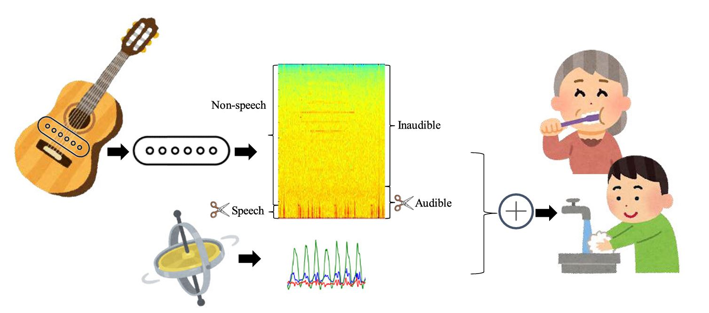
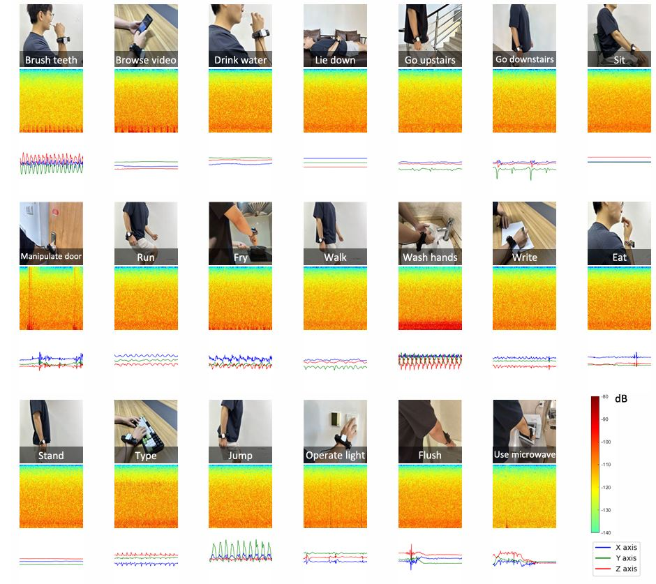
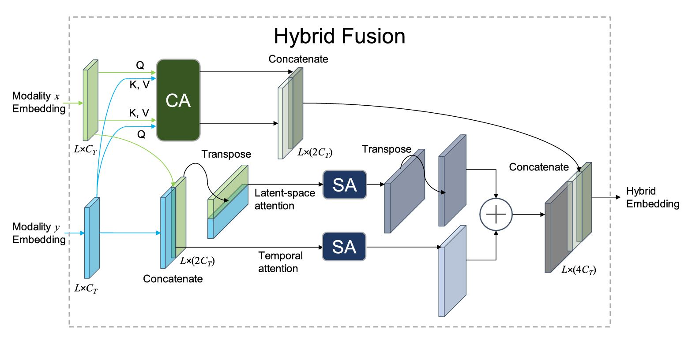

# FiHi: Fusion of inertial and high-resolution acoustic data for privacy-preserving human activity recognition

A hybrid-attention based HAR method using the fusion of IMU and Hi-res audio data. The relevant paper is at: https://ieeexplore.ieee.org/document/10980212 DOI: 10.1109/TIM.2025.3565250
If you use the dataset or mention the paper in an academic work, please cite: 
```
@ARTICLE{10980212,
  author={Yang, Zhe and Zhang, Ying and Li, Yanjun and Huang, Linchong and Hu, Ping and Lin, Yuexiang},
  journal={IEEE Transactions on Instrumentation and Measurement}, 
  title={Fusion of Inertial and High-resolution Acoustic Data for Privacy-Preserving Human Activity Recognition}, 
  year={2025},
  volume={74},
  number={},
  pages={1-20},
  keywords={Human activity recognition;Sensors;Acoustics;Feature extraction;Privacy;Microphones;Biomedical monitoring;Wireless fidelity;Sensor phenomena and characterization;Sensor fusion;Human activities recognition;inertial sensing;Hi-res audio;attention mechanism},
  doi={10.1109/TIM.2025.3565250}}
```



## 1. Datasets
The original and processed data are at: https://zenodo.org/uploads/15347282
## 2. Running the code
We use Conda for environment creation.
```shell
conda env create -f environment.yml
```
It will create a new env called 'FiHi-HAR'. Activate this env and open the Notebook.
```shell
conda activate FiHi-HAR
jupyter-notebook
```
The main code is at `./Notebook/code/hybrid_lopo/hybrid_lopo.ipynb`. Before running the code, please download the dataset and place it at `./Processed_data`

We provide the pre-trained models for the output in the original paper at `./Notebook/finalresult/hybrid_896`, where 896 refers to 8kHz-96kHz frequency range, together with 196 and 2096. (Different hardware and software settings seem to yield different results)

## 3. Acknowledgement
The implementation of the Transformer encoder for different modalities was built based on the awesome project: [HAR-Transformer](https://github.com/markub3327/HAR-Transformer)